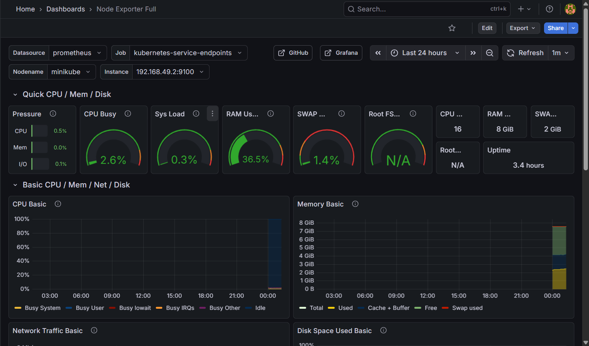
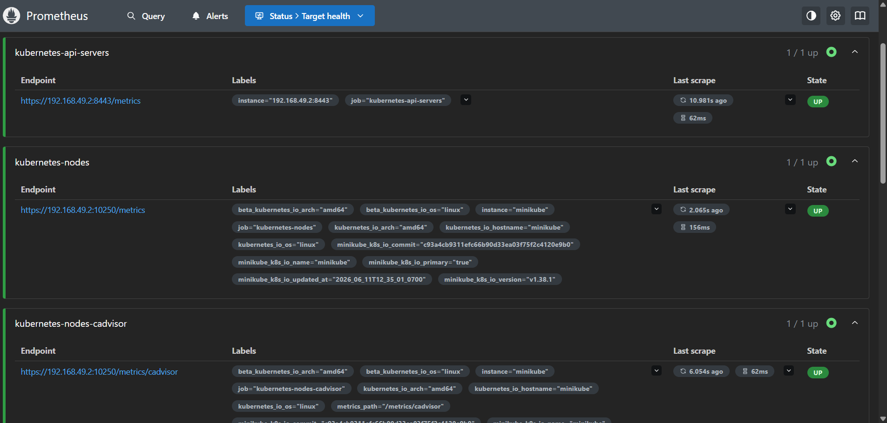
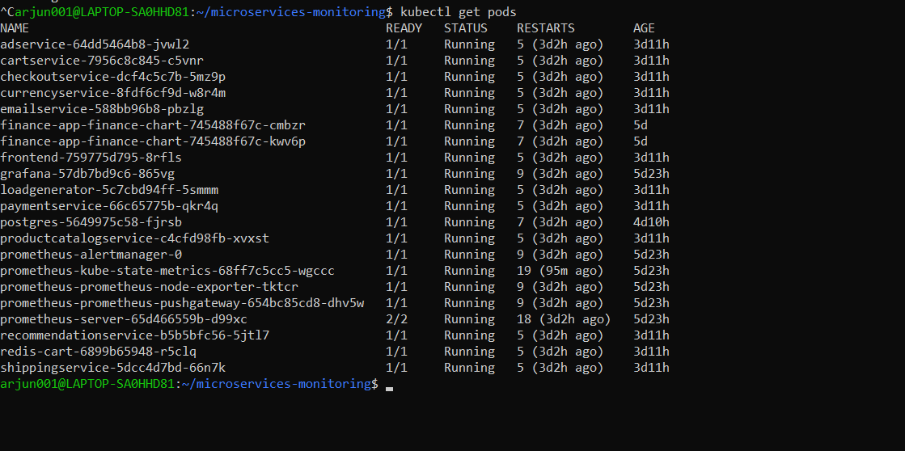
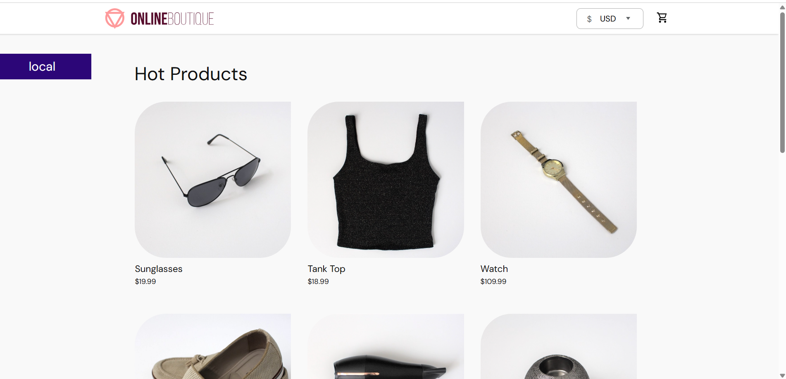

# Kubernetes Monitoring Platform

## Overview

This project demonstrates the deployment and monitoring of a cloud-native microservices application on Kubernetes using Prometheus, Grafana, and Alertmanager.

The platform provides real-time visibility into cluster health, node performance, application metrics, and service availability. It is designed to showcase modern DevOps monitoring practices in a Kubernetes environment.

---

## Architecture

```text
+----------------------+
|  Microservices App   |
+----------+-----------+
           |
           v
+----------------------+
|      Kubernetes      |
|       Cluster        |
+----------+-----------+
           |
           +--------------------+
           |                    |
           v                    v
+----------------+    +----------------+
|   Prometheus   |    |  Alertmanager  |
| Metrics Store  |    | Alert Handling |
+-------+--------+    +----------------+
        |
        v
+----------------+
|    Grafana     |
| Visualization  |
+----------------+
```

---

## Technologies Used

* Kubernetes
* Minikube
* Docker
* Prometheus
* Grafana
* Alertmanager
* Node Exporter
* kube-state-metrics
* Git
* GitHub
* Linux (WSL)

---

## Features

* Kubernetes cluster monitoring
* Node resource monitoring
* Pod health monitoring
* Application metrics collection
* Grafana dashboards for visualization
* Alert management using Alertmanager
* Prometheus metrics scraping
* Real-time infrastructure observability

---

## Monitored Components

### Kubernetes Metrics

* Node status
* Pod status
* Deployment health
* Cluster resources

### Infrastructure Metrics

* CPU utilization
* Memory utilization
* Disk usage
* Network traffic
* System load

### Application Metrics

* Service availability
* Container health
* Microservice performance

---

## Dashboards

### Kubernetes Cluster Dashboard

Provides an overview of cluster health, node status, and resource utilization.

### Node Exporter Dashboard

Displays detailed infrastructure metrics including CPU, memory, disk, and network usage.

### Kubernetes Monitoring Dashboard

Tracks pod status, deployments, and Kubernetes resource consumption.

---

## Screenshots

### Grafana Dashboard



### Prometheus Targets



### Kubernetes Pods



### Microservices Application



---

## Project Structure

```text
kubernetes-monitoring-platform/
│
├── alerts/
│   └── custom-alerts.yaml
│
├── monitoring/
│   └── prometheus-notes.md
│
├── docs/
│   └── architecture.md
│
├── screenshots/
│   ├── grafana2.png
│   ├── prometheus.png
│   ├── kubernetes.png
│   └── microservices.png
│
└── README.md
```

---

## Key Learning Outcomes

* Kubernetes deployment and management
* Cluster observability and monitoring
* Metrics collection using Prometheus
* Dashboard creation with Grafana
* Alerting workflows using Alertmanager
* Infrastructure monitoring best practices
* DevOps monitoring ecosystem integration

---

## Future Enhancements

* Email notifications
* Slack alert integration
* CI/CD pipeline integration
* Helm-based deployment automation
* Log aggregation using ELK Stack
* Distributed tracing with Jaeger

---

## Author

**Arjun Kumar**

DevOps | Cloud Computing | Kubernetes | Monitoring & Observability

